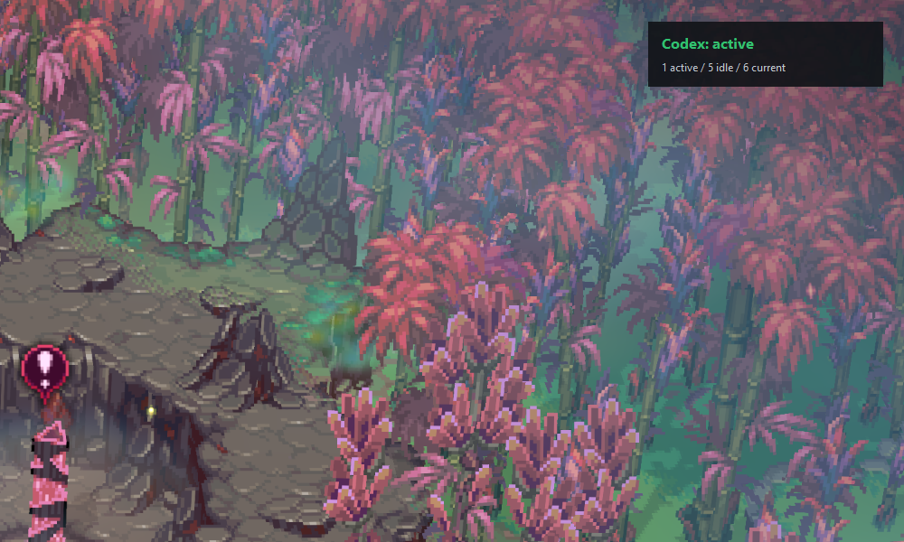

# Agent Warden

Agent Warden is a local status overlay for developers who leave AI coding agents running in the background and then switch to something else, especially a fullscreen or borderless-windowed game.

It gives you a small always-on-top status panel that answers the practical question: are my agents still working, idle, finished, or waiting for attention?

## What It Shows

The overlay summarizes local Codex agent activity at a glance:

- Active sessions that were modified recently.
- Idle sessions that have stopped changing for a while.
- Finished sessions that look complete based on file activity.
- Current sessions that still matter now, without old history dominating the display.
- Attention states reserved for future privacy-reviewed event parsing.

This is meant for quick peripheral monitoring while you are away from VS Code. For example, you can keep playing and glance at the overlay to see whether your agents are still active or whether it is time to switch back.

## Features

- Start, stop, and restart the local overlay from the Command Palette.
- Run a one-shot metadata scan and view the result in the Agent Warden output channel.
- Change the overlay corner without editing config files.
- Use the VS Code status bar item as a compact command menu.
- Keep monitoring local-only, with no telemetry and no cloud backend.
- Preserve prompt privacy by using filesystem metadata instead of reading session contents.

## Commands

- `Agent Warden: Start`
- `Agent Warden: Stop`
- `Agent Warden: Restart`
- `Agent Warden: Scan Once`
- `Agent Warden: Set Position`
- `Agent Warden: Show Output`
- `Agent Warden: Commands`

Click the `Agent Warden` status bar item to open the command menu directly.

## Settings

- `agentWarden.position`: Overlay corner position.
- `agentWarden.pollIntervalSeconds`: Polling interval in seconds.
- `agentWarden.activeThresholdSeconds`: Modification-age threshold for active sessions.
- `agentWarden.opacity`: Overlay opacity.
- `agentWarden.sessionsRoot`: Optional Codex sessions root override.
- `agentWarden.pythonPath`: Optional Python executable override.
- `agentWarden.autoStart`: Start Agent Warden when VS Code finishes starting.

## Privacy

Agent Warden is local-first by design:

- No telemetry.
- No account system.
- No cloud backend.
- No network calls for monitoring.
- No JSONL prompt or completion content parsing.

The extension launches the local Python app and displays command output. It does not add a second Codex log parser in TypeScript.

## Requirements

- Windows is the primary target.
- Python 3.12 or newer must be available.
- Codex session monitoring depends on local Codex session files.

If Python is not auto-detected, set `agentWarden.pythonPath` to the Python executable you want the extension to use.
